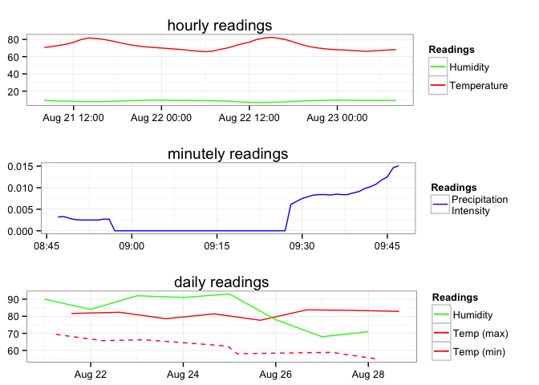

[](https://travis-ci.org/hrbrmstr/Rforecastio)

Rforecastio - API access to the [Forecast API](https://developer.forecast.io/docs/v2) from R.

-   Forecast API Docs: <https://developer.forecast.io/docs/v2>
-   Forecast Dev site: <https://developer.forecast.io/>

**NOTE: THIS IS A MAJOR REWRITE OF THE INTERFACE**

One of the biggest changes (besides splitting one function into two) is that the API wrapper functions in this package all rely on a ForecastIO API key that now resides in the environment variable . The easiest way to get this into your environment is to set it in the `\code{.Renviron}` file in your home directory.

The following functions are implemented:

-   `forecastio_api_key` : Get or set FORECASTIO\_API\_KEY value
-   `get_current_forecast` : Retrieve the current forecast (for the next week)
-   `get_forecast_for` : Retrieve weather data for a specific place/time
-   `plot.rforecastio` : Plot method for rforecastio objects

There have been several major enhancements to the way this package works with the API. Also, the structures returned in the list are now classes as `rforecastio` objects (which afford the use of an S3 plotting method) and the data frames are now `tbl_df` objects (so they work like regular data frames but get all the `dplyr` goodness, too).

### News

-   Version 2.1.0 released - added `httr::GET` pass-through `...` parameter to salient functions
-   Version 2.0.0 released - complete overhaul of the package
-   Version 2.0.1 released - Did a check `--as-cran` and fixed *many* things invisible to the users of this package

### Installation

``` r
devtools::install_github("hrbrmstr/Rforecastio")
```

### Usage

``` r
library(Rforecastio)
```

    ## Loading required package: ggplot2

``` r
# current verison
packageVersion("Rforecastio")
```

    ## [1] '2.1.0'

``` r
now <- get_current_forecast(43.2672, -70.8617)
print(now$hourly)
```

    ## Source: local data frame [49 x 16]
    ## 
    ##                   time    summary   icon precipIntensity precipProbability precipType temperature apparentTemperature
    ## 1  2015-08-21 08:00:00 Light Rain   rain          0.0365              0.71       rain       70.62               70.62
    ## 2  2015-08-21 09:00:00   Overcast cloudy          0.0034              0.10       rain       71.70               71.70
    ## 3  2015-08-21 10:00:00    Drizzle   rain          0.0075              0.23       rain       72.99               72.99
    ## 4  2015-08-21 11:00:00   Overcast cloudy          0.0040              0.05       rain       74.44               74.44
    ## 5  2015-08-21 12:00:00    Drizzle   rain          0.0074              0.20       rain       76.69               76.69
    ## 6  2015-08-21 13:00:00 Light Rain   rain          0.0092              0.35       rain       79.71               79.71
    ## 7  2015-08-21 14:00:00 Light Rain   rain          0.0141              0.45       rain       81.64               87.53
    ## 8  2015-08-21 15:00:00 Light Rain   rain          0.0212              0.69       rain       81.19               86.58
    ## 9  2015-08-21 16:00:00 Light Rain   rain          0.0469              0.81       rain       80.12               84.40
    ## 10 2015-08-21 17:00:00 Light Rain   rain          0.0385              0.80       rain       78.61               78.61
    ## ..                 ...        ...    ...             ...               ...        ...         ...                 ...
    ## Variables not shown: dewPoint (dbl), humidity (dbl), windSpeed (dbl), windBearing (int), visibility (dbl), cloudCover
    ##   (dbl), pressure (dbl), ozone (dbl)

``` r
then <- get_forecast_for(43.2672, -70.8617, "2013-05-06T12:00:00-0400")
print(then$daily)
```

    ## Source: local data frame [1 x 24]
    ## 
    ##         time          summary icon         sunriseTime          sunsetTime moonPhase precipIntensity precipIntensityMax
    ## 1 2013-05-06 Foggy overnight.  fog 2013-05-06 05:30:55 2013-05-06 19:51:42       0.9               0                  0
    ## Variables not shown: precipProbability (int), temperatureMin (dbl), temperatureMinTime (time), temperatureMax (dbl),
    ##   temperatureMaxTime (time), apparentTemperatureMin (dbl), apparentTemperatureMinTime (time), apparentTemperatureMax
    ##   (dbl), apparentTemperatureMaxTime (time), dewPoint (dbl), humidity (dbl), windSpeed (dbl), windBearing (int),
    ##   visibility (dbl), cloudCover (dbl), pressure (dbl)

``` r
# getting data for more than one location

more_than_one <- data.frame(loc=c("Maine", "Seattle"),
                            lon=c(43.2672, 47.6097),
                            lat=c(70.8617, 122.3331),
                            when=c("2013-05-06T12:00:00-0400",
                                   "2013-05-06T12:00:00-0400"),
                            stringsAsFactors=FALSE)

bigger_list <- mapply(get_forecast_for, 
       more_than_one$lon, more_than_one$lat, more_than_one$when,
       SIMPLIFY=FALSE)
names(bigger_list) <- more_than_one$loc

bigger_list$Seattle[[1]]
```

    ## Source: local data frame [24 x 13]
    ## 
    ##                   time       summary                icon precipType temperature apparentTemperature dewPoint humidity
    ## 1  2013-05-06 12:00:00 Partly Cloudy partly-cloudy-night       rain       57.34               57.34    36.96     0.46
    ## 2  2013-05-06 13:00:00         Clear         clear-night       rain       55.78               55.78    37.89     0.51
    ## 3  2013-05-06 14:00:00         Clear         clear-night       rain       54.52               54.52    38.45     0.54
    ## 4  2013-05-06 15:00:00 Partly Cloudy partly-cloudy-night       rain       53.33               53.33    38.50     0.57
    ## 5  2013-05-06 16:00:00 Partly Cloudy partly-cloudy-night       rain       52.43               52.43    38.36     0.59
    ## 6  2013-05-06 17:00:00 Partly Cloudy   partly-cloudy-day       rain       52.86               52.86    38.38     0.58
    ## 7  2013-05-06 18:00:00 Mostly Cloudy   partly-cloudy-day       rain       55.25               55.25    38.42     0.53
    ## 8  2013-05-06 19:00:00 Partly Cloudy   partly-cloudy-day       rain       58.97               58.97    38.10     0.46
    ## 9  2013-05-06 20:00:00 Partly Cloudy   partly-cloudy-day       rain       63.02               63.02    37.66     0.39
    ## 10 2013-05-06 21:00:00 Partly Cloudy   partly-cloudy-day       rain       67.49               67.49    37.57     0.33
    ## ..                 ...           ...                 ...        ...         ...                 ...      ...      ...
    ## Variables not shown: windSpeed (dbl), windBearing (int), visibility (dbl), cloudCover (dbl), pressure (dbl)

``` r
bigger_list$Maine[[1]]
```

    ## Source: local data frame [24 x 13]
    ## 
    ##                   time summary        icon precipType temperature apparentTemperature dewPoint humidity windSpeed
    ## 1  2013-05-05 14:00:00   Clear clear-night       rain       53.29               53.29    35.65     0.51      3.41
    ## 2  2013-05-05 15:00:00   Clear clear-night       rain       52.38               52.38    36.48     0.55      3.32
    ## 3  2013-05-05 16:00:00   Clear clear-night       rain       51.25               51.25    40.43     0.66     13.00
    ## 4  2013-05-05 17:00:00   Clear clear-night       rain       48.31               48.31    37.36     0.66      2.53
    ## 5  2013-05-05 18:00:00   Clear clear-night       rain       50.96               50.96    38.04     0.61      2.05
    ## 6  2013-05-05 19:00:00   Clear clear-night       rain       50.25               50.25    38.24     0.63      3.49
    ## 7  2013-05-05 20:00:00   Clear clear-night       rain       48.85               48.36    36.79     0.63      3.01
    ## 8  2013-05-05 21:00:00   Clear   clear-day       rain       55.50               55.50    41.43     0.59      3.97
    ## 9  2013-05-05 22:00:00   Clear   clear-day       rain       61.63               61.63    41.26     0.47      1.12
    ## 10 2013-05-05 23:00:00   Clear   clear-day       rain       61.24               61.24    39.30     0.44      2.82
    ## ..                 ...     ...         ...        ...         ...                 ...      ...      ...       ...
    ## Variables not shown: windBearing (int), visibility (dbl), cloudCover (dbl), pressure (dbl)

``` r
print(sprintf("You have used %s API calls.", then$`x-forecast-api-calls`))
```

    ## [1] "You have used 9 API calls."

``` r
plot(now)
```



### Test Results

``` r
library(Rforecastio)
library(testthat)

date()
```

    ## [1] "Fri Aug 21 08:47:32 2015"

``` r
test_dir("tests/")
```

    ## testthat results ========================================================================================================
    ## OK: 2 SKIPPED: 0 FAILED: 0
    ## 
    ## DONE
