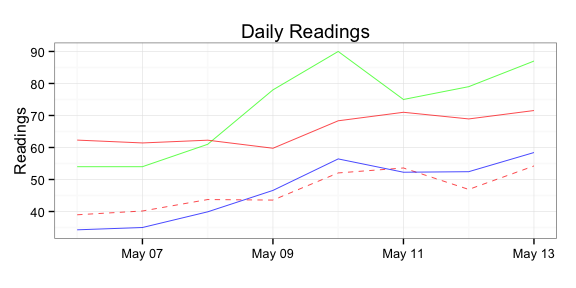
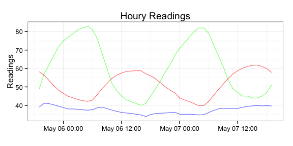

I've bumped up the version number of `Rforecastio` to `1.1.0`. The new
features are:

-   removing the SSL certificate bypass check (it doesn't need it
    anymore)
-   using `plyr` for easier conversion of JSON-\>data frame
-   adding in a new `daily` forecast data frame
-   roxygen2 inline documentation

<!-- -->

    library(Rforecastio)
    library(ggplot2)
    library(plyr)

    # NEVER put API keys in revision control systems or source code!
    fio.api.key= readLines("~/.forecast.io")

    my.latitude = "43.2673"
    my.longitude = "-70.8618"

    fio.list <- fio.forecast(fio.api.key, my.latitude, my.longitude, proxy='www-proxy.lmig.com:80')

    fio.gg <- ggplot(data=fio.list$hourly.df, aes(x=time, y=temperature))
    fio.gg <- fio.gg + labs(y="Readings", x="Time", title="Houry Readings")
    fio.gg <- fio.gg + geom_line(aes(y=humidity*100), color="green")
    fio.gg <- fio.gg + geom_line(aes(y=temperature), color="red")
    fio.gg <- fio.gg + geom_line(aes(y=dewPoint), color="blue")
    fio.gg <- fio.gg + theme_bw()
    fio.gg

    fio.gg <- ggplot(data=fio.list$daily.df, aes(x=time, y=temperature))
    fio.gg <- fio.gg + labs(y="Readings", x="Time", title="Daily Readings")
    fio.gg <- fio.gg + geom_line(aes(y=humidity*100), color="green")
    fio.gg <- fio.gg + geom_line(aes(y=temperatureMax), color="red")
    fio.gg <- fio.gg + geom_line(aes(y=temperatureMin), color="red", linetype=2)
    fio.gg <- fio.gg + geom_line(aes(y=dewPoint), color="blue")
    fio.gg <- fio.gg + theme_bw()
    fio.gg

